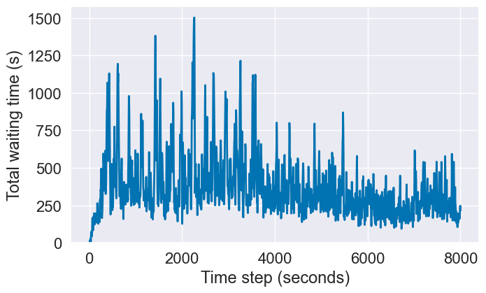
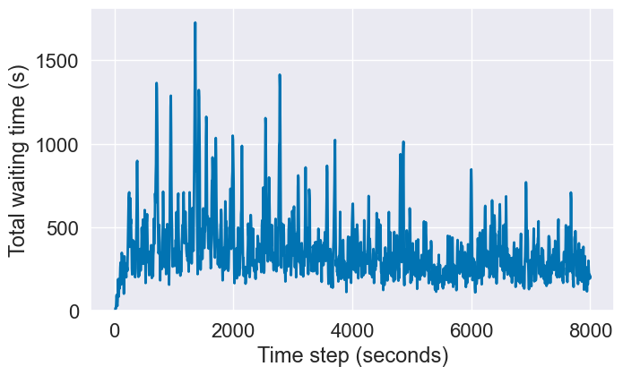
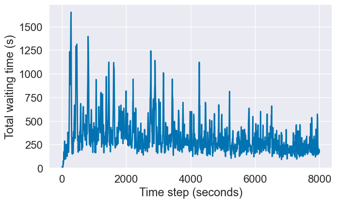
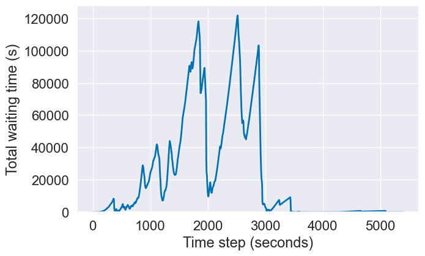
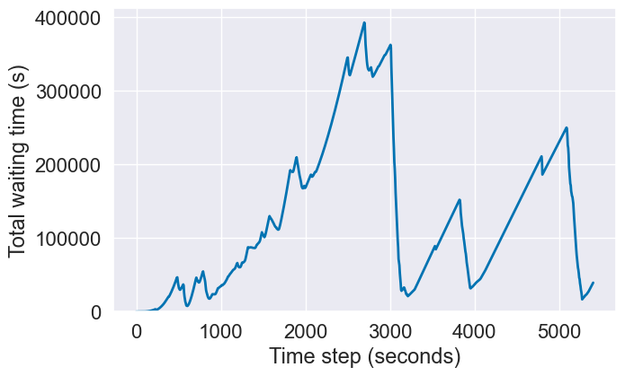
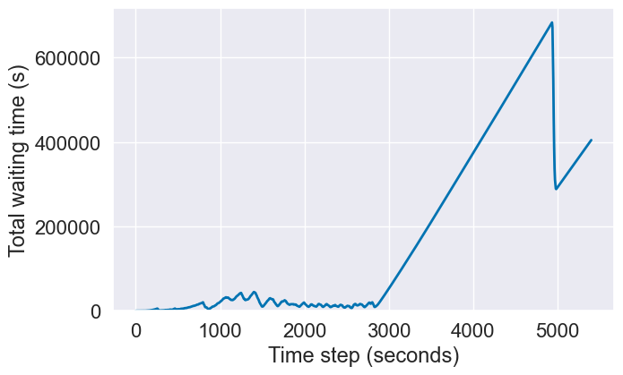

# Q-learning

Количество шагов уменьшено до 8000

**Готовая реализация**

**Моя реализация**

**Моя реализация с использованием SARSA**

В Целом результаты схожи, но SARSA выглядит чуть более стабильной и начинает показывать уменьшение total waiting time раньше остальных алгоритмов

# DQN
Количество шагов снижено с 100000 до 30000

К сожалению готовую реализацию не удалось довести до 27 эпизода, так как программа начала вылетать, поэтому сравнение будет на 9 эпизоде для обоих реализаций

По графикам видно, что готовая реализации при увеличении time step сильно увеличивает total waiting time, его не происходит в моей реализации, в моей реализации он наоборот уменьшается периодически и в итоге уменьшится до стабильного состояния, это можно наблюдать на графике 27 эпизода
